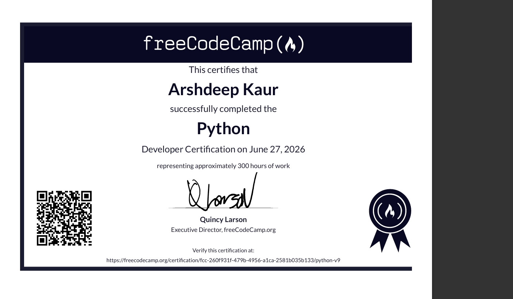

#🎓 freeCodeCamp:
Scientific Computing with Python
 * ## My Python Certification
 * 

 
 
 ###🚀🚀 My learning journey 
 This repository contains my progress through the Python curriculum. I'm building projects to master data types, logic, and scientific computing.
 ### 📂 Projects:
 * **Report Card Printer**✅(completed)
 * **Employee Profile**✅(completed)
 * **Build a bill splitter**✅(completed)
 * **Build a movie ticket calculator**✅(completed)
 * **Build a travel weather planner**✅(completed)
 * **Build a ceasar cipher**✅(completed)
 * **Build a Planet Class**✅(completed)
 * **Build an Email Stimulator**✅(completed)
 * **Build a Budget App**✅(completed)
 * **Build a Polygon Area Calculator**✅(completed)
 * **Build a Musical Instrument Inventory**✅(completed)
 * **Build a Pin Extractor**✅(completed)
 * **Build a Medical Data Validator**✅(completed)

 
